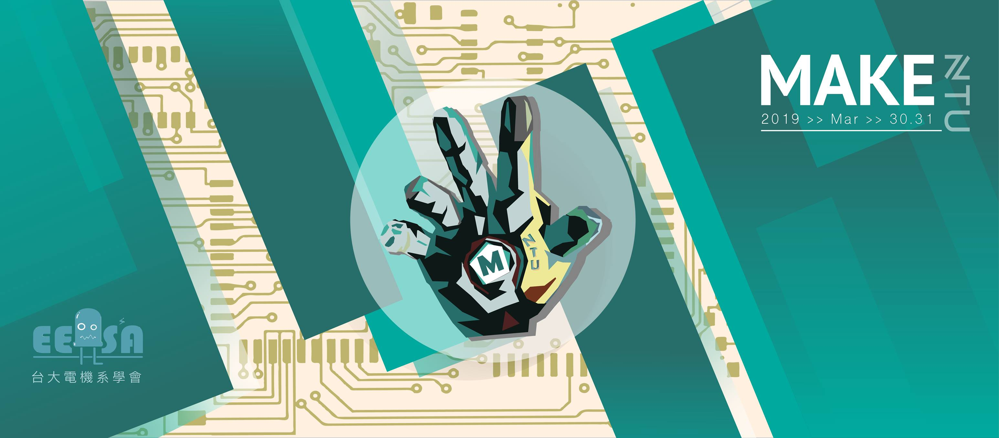

# MakeNTU 2019 workshop - FaceLock

MakeNTU 2019 工作坊小project - 用 Microsoft Azure, OpenCV, Raspberry Pi 3 製作一個人臉置物櫃鎖



## Requirements

- a Raspberry Pi 3 model B+
- a servo motor
- a web-cam
- python3
- python-opencv installed

## Microsoft Azure apply

### 辦帳號

如果有學校信箱，可直接申請教育試用版，免綁信用卡

https://azure.microsoft.com/zh-tw/free/students/


需要驗證學校的電子郵件


按同意，申請完成


### 開通API

來到 Azure 首頁


點選"建立資源"


點選"AI + 機器學習服務"，選"Face"


填入名稱、位置(server位置)、Pricing Tier 選 f0、Resource group 按"新建"創一個


稍等一會就會顯示部署成功，可以按"釘選到儀表板"


從儀表板進入資源(右上角)


進入keys取得金鑰


複製下金鑰(任一支)，等等用


## 前製作業

- 在程式碼 `face_api.py` 的第6行 填入 `###your azure api key###` 和 `###you server location###`
- 將 servo motor 與 GPIO pin腳連接:
  - 紅 <=> pin 2
  - 棕 <=> pin 6
  - 橘 <=> pin 11
  - 
  - 
- 將 web-cam 用 USB 與 RPi 相接

## Run Code

1. 跑 `python3 -i servo.py`:

```
>>> s = Servo()
>>> s.turn(90)
```

確認伺服馬達是否運作正常。

2. 跑 `python3 -i camera.py`:

```
>>> s = Scanner(0)
>>> s.get_photo("test.png")
```

確認 web-cam 是否有拍下照片 `"test.png"`。

3. 跑 `python3 -i face_api.py`:

```
>>> s = AzureAPI()
>>> s.GetFaceId("test.png")
```

確認 API 是否有回傳資料。


4. 如果一切順利，就可以跑 `main_gui.py`了。

## 使用說明
`main_gui.py` 正常執行下會出現GUI小視窗：


1. 先將臉部對準 web-cam，按 register 註冊，登錄成功後 Lock 會打開，在 Checkout 之前無法再次註冊
2. 按 Lock 將鎖鎖上後，下次可再將臉部對準 web-cam 按 Unlock 開鎖，若是其他人則無法開鎖
3. 在上鎖的情況下可按將臉部對準 web-cam 按 Checkout，確認是本人後即可登出，並可由下一位使用者再次註冊
4. 所有錯誤操作皆會顯示提示字眼於下方，如：人臉沒有對準鏡頭，會顯示 `Face Not Detected!`。